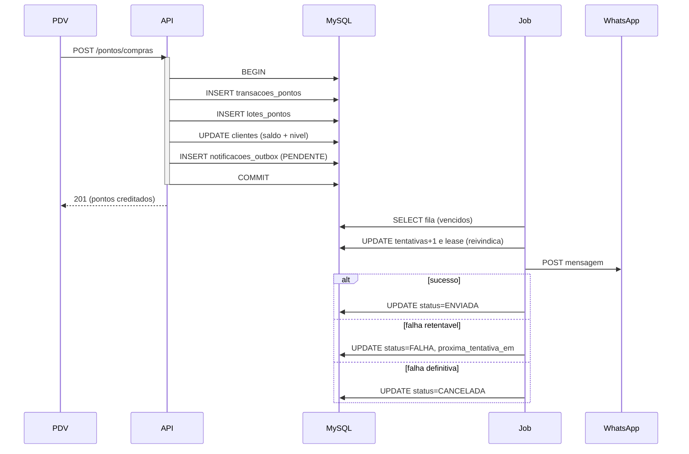

# Arquitetura do PromoSys

Documento de decisões, invariantes e guia de contribuição do backend do programa
de fidelidade. Ele existe para responder "por que está assim?" antes de alguém
perguntar "quem fez isso?" — toda escolha relevante tem justificativa, e toda
regra que **não pode** ser quebrada está listada na seção de invariantes.

---

## 1. Contexto e restrições

| Fato do domínio | Consequência técnica |
| --- | --- |
| Varejo físico, muitos caixas gravando ao mesmo tempo | Escrita serializada por linha (`FOR UPDATE`), transações curtas |
| Saldo de pontos é dinheiro simbólico | `DECIMAL` no banco, livro razão imutável, auditoria de tudo |
| Picos em datas promocionais | Pool de conexões dimensionado, idempotência por documento fiscal |
| Loja cai e volta; PDV repete requisição | Idempotência no banco (índices únicos), não na aplicação |
| LGPD | Consentimentos versionados, `audit_log`, dados mínimos no log |

## 2. Stack e por quê

- **Node.js ≥ 20.11 (ESM)** — `--env-file`, `--watch` e `node:test` nativos; sem
  transpilador, sem bundler no backend.
- **Fastify 5** — throughput maior que Express, validação e serialização
  acopladas a schema, plugins encapsulados (`fastify-plugin`).
- **MySQL/MariaDB + `mysql2/promise`** — `execute()` = prepared statement
  (parâmetro nunca interpolado); Pool reutiliza conexões autenticadas.
- **Zod + `fastify-type-provider-zod`** — um schema gera validação, tipos e
  OpenAPI. Nada entra no service sem passar por schema.
- **JWT HS512 + refresh rotativo** — access curto e sem estado; revogação pelo
  refresh opaco (guardado só como SHA-256, com detecção de reuso).
- **bcrypt** — custo configurável, comparação em tempo constante.
- **Pino** — log JSON estruturado com redação de campos sensíveis.

## 3. Camadas

```
rotas (*.routes.js)      HTTP + schema Zod + RBAC
   ↓                     não contém regra de negócio
controllers              traduz HTTP ↔ service (status, corpo, headers)
   ↓
services                 REGRA DE NEGÓCIO + limites transacionais
   ↓                     é o único lugar que abre transação
repositories             SQL parametrizado + mappers (linha → objeto de domínio)
   ↓
MySQL                    restrições, índices e CHECKs como última linha de defesa
```

Regras de dependência:

- repository **nunca** importa service; service **nunca** conhece `request`/`reply`.
- `core/` é infraestrutura transversal e não contém regra de negócio.
- `config/constants.js` espelha os `ENUM` do SQL. Se mudar um, mude o outro.

## 4. Invariantes

Quebrar qualquer item abaixo é bug crítico, não "detalhe":

1. `clientes.pontos_saldo === SUM(lotes_pontos.pontos_disponiveis)`
   (`pontos_saldo` é **cache** materializado para leitura O(1) no balcão).
2. `pontos_saldo` nunca é negativo (validação no service + `CHECK` no MySQL).
3. Todo movimento de pontos gera uma linha em `transacoes_pontos` (razão
   imutável, sem `UPDATE`/`DELETE` de histórico).
4. Toda operação sensível gera entrada em `audit_log` (quem, o quê, quando, de onde).
5. Débito consome lotes em **FIFO por vencimento** — o que expira primeiro sai primeiro.
6. Ordem de lock: **cliente → lote**, sempre. É o que evita deadlock entre dois
   PDVs mexendo no mesmo cliente.
7. A unidade do operador vem **da sessão**, nunca do corpo da requisição.
8. Nenhuma chamada de rede acontece dentro de uma transação: o aviso ao cliente
   nasce na outbox (`notificacoes_outbox`) e sai por job (§7).

A invariante 1 é verificável a qualquer momento:

```bash
npm run conciliar          # relatório (somente leitura)
npm run conciliar -- --corrigir
```

## 5. Modelo de concorrência

- **Serialização por linha**: `SELECT ... FOR UPDATE` na linha do cliente é o
  mutex do programa de fidelidade. Duas compras para o mesmo cliente rodam em
  série; clientes diferentes rodam em paralelo.
- **Transações curtas**: nenhuma chamada de rede dentro de `withTransaction`.
- **Isolamento `READ COMMITTED`** (padrão do `db.withTransaction`): evita
  surpresa de gap lock do `REPEATABLE READ` em ambiente de escrita concorrente.
- **Uso de `mysql2/promise` via pool** — `db.query/queryOne/execute` aceitam um
  `executor` (a conexão da transação) para que a mesma transação seja usada em
  todos os repositórios.

## 6. Idempotência

| Operação | Mecanismo | Onde |
| --- | --- | --- |
| Crédito por compra (NFC-e/SAT) | `uk_transacoes_documento (unidade_id, documento_fiscal, origem)` + checagem prévia | `pontos.service.registrarCompra` |
| Estorno | `uk_transacoes_estorno (estorno_de_transacao_id)` | `pontos.service.estornar` |
| Expiração de lote | revalida o lote dentro da transação; lote zerado não volta | `jobs/expirar-pontos.js` |
| Resgate | transação única de débito + `status` do resgate | `recompensas` |

Regra geral: **a idempotência vive no banco**. Reenviar a requisição é normal
(rede de loja oscila); o segundo envio tem que ser inofensivo.

## 7. Notificações: outbox transacional

Avisar o cliente no WhatsApp **não pode** ser feito dentro da transação que
credita pontos. Se fosse, teríamos os três problemas clássicos de integração:

- o lock da linha do cliente ficaria preso durante uma chamada de rede (o PDV
  do outro caixa espera);
- se o provedor caísse, o aviso sumiria para sempre;
- se o MySQL commitasse e a rede falhasse depois, o aviso ficaria "meio feito".

A solução é o padrão **transactional outbox**:



Decisões que sustentam isso:

| Decisão | Por quê |
| --- | --- |
| O aviso é gravado **na mesma transação** do crédito | commit atômico: ou existem os dois, ou nenhum |
| `enfileirar*` nunca lança | problema de aviso não pode derrubar o crédito do balcão; vira log |
| `uk_outbox_transacao (transacao_id, tipo, canal)` | reenvio da NFC-e / retry do estorno não duplica aviso |
| Envio **fora** de transação, com *lease* | nenhum lock de banco é mantido durante HTTP |
| Backoff exponencial com teto | provedor fora do ar volta sozinho; o teto evita fila "morta" por dias |
| 4xx (400/401) → `CANCELADA` | número inválido/credencial errada não melhora insistindo |
| 5xx/408/429/timeout → `FALHA` e reagenda | instabilidade é passageira |
| LGPD: só enfileira com telefone válido **e** consentimento `WHATSAPP` vigente | aviso ao cliente é tratamento de dado pessoal |
| O `payload` guarda a versão do termo aceito | permite provar a base legal do envio depois |

O crédito **não** depende do aviso: o canal pode estar desligado
(`NOTIFICACOES_HABILITADAS=false`) e a fila simplesmente fica vazia.

Operação:

```bash
npm run notificacoes:enviar               # drena a fila (cron a cada 5 min)
npm run notificacoes:enviar -- --situacao # retrato da fila
npm run notificacoes:enviar -- --simular  # mostra o que sairia, sem gravar nada
```

## 8. Contrato HTTP

Sucesso: `{ data, meta? }` — `meta` traz `total/limit/offset/page/pages/hasNext`.
Erro: `{ error: { code, message, details? }, requestId }`.

Códigos estáveis (o front nunca deve parsear texto de mensagem):
`VALIDATION_ERROR` 422 · `UNAUTHORIZED` 401 · `FORBIDDEN` 403 · `NOT_FOUND` 404 ·
`CONFLICT`/`RESOURCE_ALREADY_EXISTS` 409 · `BUSINESS_RULE_VIOLATION` 422 ·
`TOO_MANY_REQUESTS` 429 · `DATABASE_UNAVAILABLE` 503 · `INTERNAL_ERROR` 500.

A hierarquia em `core/errors/app-error.js` mapeia cada erro para o status HTTP;
o handler global é o único lugar que monta o corpo de erro.

## 9. Segurança

- **Fail fast no boot**: segredo curto, CORS `*` ou Swagger ligado em produção
  impedem o processo de subir (`config/env.js`).
- **Login**: bcrypt + resposta em tempo constante (não distingue usuário
  inexistente de senha errada) + rate limit específico em `/auth/login`.
- **Refresh**: rotação obrigatória; reapresentar token revogado derruba todas as
  sessões do usuário (defesa contra roubo de token).
- **SQL**: prepared statements em 100% das queries; `multipleStatements: false`;
  nomes de coluna em UPDATE vêm de whitelist (`COLUNAS_ATUALIZAVEIS`).
- **RBAC**: perfil (`ADMIN`/`GERENTE`/`OPERADOR`/`AUDITOR`) **e** escopo de
  unidade (`authorizeUnidade`). Operador só credita na própria loja.
- **Logs**: Pino com redação de campos sensíveis; corpo de requisição de PDV é
  pequeno (limite de 1 MiB).
- **LGPD nas notificações**: só entra na fila cliente com telefone válido **e**
  consentimento `WHATSAPP` vigente; a versão do termo vai junto no `payload`.
  Telefone aparece mascarado (`+5511****4321`) em log e relatório.
- **Credenciais de integração**: `WHATSAPP_API_KEY` só existe em variável de
  ambiente, nunca em código, resposta HTTP ou log — o texto do erro do provedor
  passa por `higienizarErro`, que mascara o próprio token se ele vier ecoado.
  Em produção, `WHATSAPP_PROVEDOR=log` é rejeitado no boot por não entregar nada.

## 10. Operação (jobs)

| Job | Comando | Frequência sugerida | Efeito |
| --- | --- | --- | --- |
| Expiração de pontos | `npm run pontos:expirar` | diário, 03:00 | zera lotes vencidos, gera `EXPIRACAO` no razão |
| Conciliação de saldos | `npm run conciliar` | diário, 03:30 | **relatório** de cache × lotes |
| Conciliação (correção) | `npm run conciliar -- --corrigir` | sob demanda | reconstrói `pontos_saldo` a partir dos lotes |
| Notificações (outbox) | `npm run notificacoes:enviar` | a cada 5 min | envia os avisos pendentes, com backoff |
| Notificações (retrato) | `npm run notificacoes:enviar -- --situacao` | sob demanda | fila por status, sem alterar nada |

Contrato de saída dos jobs: `0` = tudo certo · `1` = encontrou problema (o cron
transforma isso em alerta) · `2` = uso incorreto das flags.

## 11. Testes

Três camadas, todas com `node:test` (sem framework de terceiros):

| Arquivo | Precisa de MySQL? | Habilitação | O que cobre |
| --- | --- | --- | --- |
| `tests/utils.test.js` | não | `npm test` | utilitários puros (CPF, datas, paginação) |
| `tests/api.test.js` | não (usa `app.inject()`) | `PROMOSYS_API_TESTS=1` (`npm run test:api`) | contratos HTTP, health, erros, auth |
| `tests/points.integration.test.js` | sim | `PROMOSYS_POINT_TESTS=1` (`npm run test:points`) | crédito concorrente e idempotente |
| `tests/conciliation.test.js` | bloco 1 não / bloco 2 sim | `npm run test:conciliacao` | regras puras + conciliação real |
| `tests/notificacoes.test.js` | não | `npm test` | elegibilidade LGPD, mensagem, backoff, classificação de falha, cliente HTTP com `fetch` injetado |
| `tests/notificacoes.integration.test.js` | sim | `PROMOSYS_POINT_TESTS=1` (`npm run test:notificacoes`) | outbox ponta a ponta: enfileira, envia, reagenda, cancela e estorna |

Os testes de integração são **gated por variável de ambiente** de propósito:
`npm test` roda em qualquer máquina (inclusive sem banco) e nunca falha "por
falta de MySQL". Rodar a suíte completa exige o MySQL do XAMPP no ar.

## 12. Pegadinhas do banco (aprendidas na prática)

- **Collation**: o banco usa `utf8mb4_unicode_ci`. Comparar uma coluna
  `VARCHAR` com `CAST(x AS CHAR)` (que vem com a collation da conexão) aborta
  com `ER_CANT_AGGREGATE_2COLLATIONS` no MariaDB 10.4. Prefira comparação
  numérica (`entidade_id IN (SELECT id ...)`) — `VARCHAR = BIGINT` é numérico e
  não envolve collation.
- **`FOR UPDATE ... SKIP LOCKED`** exige MariaDB 10.6+/MySQL 8; não use no dev
  (10.4). O padrão do projeto é `FOR UPDATE` na linha do cliente.
- **Nível do cliente** é derivado do saldo no mesmo `UPDATE`; em MySQL, as
  atribuições são avaliadas da esquerda para a direita — por isso `nivel` vem
  **antes** de `pontos_saldo` em `ajustarSaldoEAtualizarNivel`.
- **Fuso**: o driver usa `timezone: 'Z'` e a sessão `SET time_zone = '+00:00'`.
  Conversão para America/Sao_Paulo é responsabilidade da apresentação.

## 13. Guia de contribuição

Ao adicionar um módulo (ex.: `campanhas`):

1. Crie `src/modules/campanhas/{campanhas.routes,schema,controller,service,repository}.js`.
2. Schema Zod primeiro: é ele que define o contrato público (e o OpenAPI).
3. A regra de negócio fica no service; o repository só sabe SQL.
4. Toda escrita que mexe em saldo precisa: transação, lock na ordem
   cliente → lote, linha no razão e entrada em `audit_log`.
5. Registre o router em `src/routes/index.js` sob o prefixo da API.
6. Adicione o índice no MySQL que a query nova precisa (e a migração
   correspondente em `src/database/migrations/NNN_*.sql`).
7. Escreva o teste: puro quando possível, de integração quando envolver
   concorrência, idempotência ou transação.
8. Atualize o README (endpoints) e, se mexeu em invariante, este documento.

Definition of done do projeto: `npm run lint`, `npm test`, `npm run test:api`,
`npm run test:points`, `npm run test:conciliacao`, `npm run test:notificacoes` e
`npm run build --prefix frontend` — todos verdes.

## 14. Roadmap

Feito: base do programa de fidelidade (auth, clientes, pontos, recompensas),
relatórios/filtros, expiração de lotes, conciliação de saldos e notificação ao
cliente por outbox (§7 — crédito e estorno).

Pendente (sem ordem comprometida):

1. Redis para cache de catálogo e rate limit distribuído (hoje é in-memory, por instância).
2. Webhook de entrada do provedor para status de entrega ("lida" / "falhou no WhatsApp").
3. Relatórios analíticos (BI) lendo o razão `transacoes_pontos`.
4. App do cliente (consulta de extrato e resgates) reaproveitando a API.
